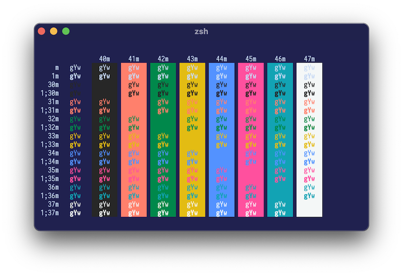

# IBM Design Color Theme for Kitty

> A kitty theme based on IBM Design Colors

## Themes

### ibm-blue.conf



## Installation

Download the theme conf file

```
curl https://raw.githubusercontent.com/hbish/ibm-kitty-theme/master/LICENSE -o ~/.config/kitty/ibm-blue.conf
```

Add the theme to your kitty conf

```
echo "include ibm-blue.conf" >> ~/.config/kitty/kitty.conf
```

## Changes/Suggestions?

Create an issue or submit an PR!

## License

[MIT License](./LICENSE)
